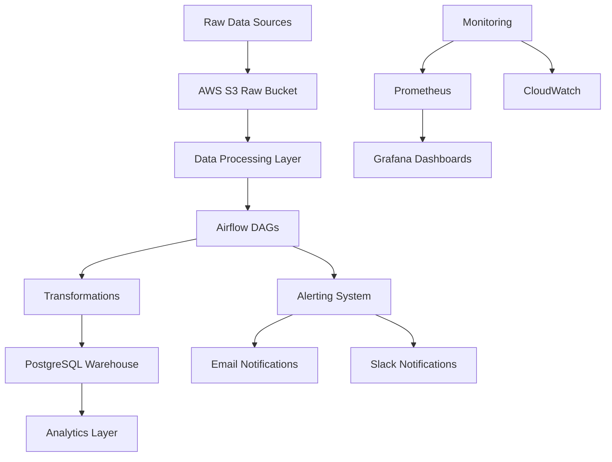

# NYC TLC Data Platform

A production-ready data platform for processing NYC Taxi and Limousine Commission (TLC) trip records. This platform handles billions of trip records with robust ETL pipelines, monitoring, and alerting systems.

## Project Overview

This data platform processes real NYC TLC Taxi Trip Records (public data from [TLC Trip Record Data](https://www.nyc.gov/site/tlc/about/tlc-trip-record-data.page)) - billions of trip records resembling transaction data (pickup/dropoff times, locations, fares, payments).

### Architecture Diagram



## Components

1. **Data Sources**: NYC TLC Yellow/Green Taxi Trip Records (Parquet/CSV)
2. **Storage**: AWS S3 for raw data, PostgreSQL RDS for processed data
3. **Processing**: Apache Airflow for orchestration
4. **Monitoring**: Prometheus, Grafana, CloudWatch
5. **Alerting**: Email and Slack notifications

## Technology Stack

- **Containerization**: Docker, Docker Compose
- **Orchestration**: Apache Airflow
- **Storage**: AWS S3, PostgreSQL RDS
- **Monitoring**: Prometheus, Grafana, AWS CloudWatch
- **Languages**: Python, SQL
- **ETL Framework**: Pandas, PyArrow for data processing

## Setup Instructions

### Prerequisites

- Docker and Docker Compose
- AWS CLI configured with appropriate permissions
- Python 3.8+

### Local Development Setup

1. Clone the repository
2. Set up environment variables in `.env` file
3. Start services with Docker Compose
4. Initialize Airflow database

```bash
# Copy environment template
cp .env.example .env
# Edit .env with your configuration
nano .env

# Build and start services
docker-compose up -d --build
```

### AWS S3 Setup

Before running the data pipeline, you need to set up S3 buckets for storing raw and processed data:

```bash
# Make the S3 setup script executable
chmod +x scripts/s3_setup.sh

# Run the setup script
./scripts/s3_setup.sh
```

The script will:
- Create two S3 buckets (raw and processed data)
- Configure lifecycle policies for cost optimization
- Generate a configuration file with bucket names

### PostgreSQL Data Warehouse Setup

The platform includes a PostgreSQL data warehouse with the following schema:

- **taxi_data.yellow_tripdata**: Table for Yellow Taxi Trip Records
- **taxi_data.green_tripdata**: Table for Green Taxi Trip Records
- **taxi_data.taxi_zone_lookup**: Taxi zone lookup table
- **taxi_data.pipeline_logs**: Pipeline execution logs
- **taxi_data.data_quality_metrics**: Data quality metrics

The schema includes appropriate indexes for query performance and triggers to maintain data integrity.

### Data Download Process

The platform includes scripts to download NYC TLC data directly from the official source:

```bash
# Download latest 3 months of yellow taxi data
python scripts/tlc_data_downloader.py --type yellow --latest 3 --s3-bucket your-raw-bucket-name

# Download specific date range of green taxi data
python scripts/tlc_data_downloader.py --type green --start-year 2023 --start-month 1 --end-year 2023 --end-month 12 --s3-bucket your-raw-bucket-name

# Download using the bash script wrapper
chmod +x scripts/download_tlc_data.sh
./scripts/download_tlc_data.sh --type yellow --latest 6
```

To download the taxi zone lookup data:
```bash
python scripts/taxi_zone_downloader.py
```

### Airflow DAGs

The platform includes several Airflow DAGs for ETL and monitoring:

- **nyc_tlc_etl_pipeline**: Processes Yellow Taxi data
- **nyc_tlc_green_taxi_etl_pipeline**: Processes Green Taxi data
- **nyc_tlc_data_quality_monitoring**: Monitors data quality and sends alerts

### Monitoring Setup

The platform includes comprehensive monitoring using multiple tools:

#### Prometheus & Grafana
- System metrics (CPU, memory, disk usage)
- Container metrics (cAdvisor)
- Database metrics (PostgreSQL Exporter)
- Application metrics (Airflow, custom metrics)
- Pre-configured dashboards for data platform overview and Airflow monitoring

#### AWS CloudWatch
- S3 bucket monitoring (size, request errors)
- RDS PostgreSQL monitoring (CPU, memory, storage, connections)
- Custom metrics for pipeline health

To set up monitoring:
```bash
# Set up CloudWatch alarms for AWS resources
python scripts/cloudwatch_setup.py

# Set up Grafana dashboards
python scripts/grafana_setup.py
```

### Alerting System

The platform includes a comprehensive alerting system with:

- **Email notifications**: Configurable email alerts for different severity levels
- **Slack notifications**: Real-time alerts to Slack channels
- **Alert routing**: Different notification paths for different types of alerts (Airflow, S3, RDS, etc.)
- **Inhibition rules**: Prevent alert spam by inhibiting less severe alerts when more severe ones are firing
- **Grouping**: Group related alerts together to reduce notification volume

To test the alerting system:
```bash
# Send a test alert
python scripts/alert_management.py test

# Check alert system status
python scripts/alert_management.py status

# Create an alert based on pipeline execution
python scripts/alert_management.py create-pipeline-alert --pipeline-name my-pipeline --run-id run-123 --status FAILED --records-failed 10
```

### Production Issue Simulation and Troubleshooting

The platform includes tools for simulating production issues and troubleshooting:

- **Issue Simulation**: Scripts to simulate common production issues like delayed files, corrupt data, and pipeline failures
- **Troubleshooting Utilities**: Tools to diagnose and resolve common issues
- **Comprehensive Troubleshooting Guide**: Detailed documentation for handling various scenarios

To run issue simulation:
```bash
# Simulate production issues
python scripts/troubleshooting.py simulate

# Run troubleshooting checks
python scripts/troubleshooting.py troubleshoot

# Run both simulation and troubleshooting
python scripts/troubleshooting.py both
```

### Documentation and Diagrams

Complete system documentation including architecture diagrams, deployment instructions, and operational procedures is available in the `docs/` directory:

- `comprehensive_documentation.md` - Full system documentation with architecture diagrams
- `troubleshooting_guide.md` - Detailed troubleshooting procedures
- `README.md` in docs/ - Instructions for generating system screenshots

### Infrastructure Components

The platform consists of several key components orchestrated via Docker Compose:

- **Airflow**: Orchestration engine with webserver, scheduler, and workers
- **PostgreSQL**: Metadata database for Airflow and data warehouse for processed data
- **Redis**: Message broker for Celery executor
- **Prometheus**: Metrics collection and monitoring
- **Grafana**: Visualization and dashboarding
- **Node Exporter**: System metrics collection
- **cAdvisor**: Container metrics collection
- **PostgreSQL Exporter**: Database metrics collection

## Data Pipeline Flow

1. **Extract**: Download NYC TLC trip data from public sources
2. **Load**: Store raw data in S3 bucket
3. **Transform**: Clean, validate, and enrich data using Airflow
4. **Load**: Insert processed data into PostgreSQL data warehouse
5. **Monitor**: Track pipeline health and data quality metrics

## Data Schema

The processed data includes key fields:
- Trip information (pickup/dropoff datetime, location)
- Passenger count and trip distance
- Fare details (rate type, payment type)
- Taxi zone information (with enriched location data)

## Monitoring & Alerting

- Data freshness checks
- Quality validation rules
- Pipeline execution monitoring
- Resource utilization tracking
- Automated failure notifications

## Production Features

- Idempotent transformations
- Data lineage tracking
- Error handling and retry mechanisms
- SLA compliance monitoring (99% uptime)
- Disaster recovery procedures

## Contributing

See `CONTRIBUTING.md` for details on contributing to this project.

## License

MIT License - see `LICENSE` file for details.