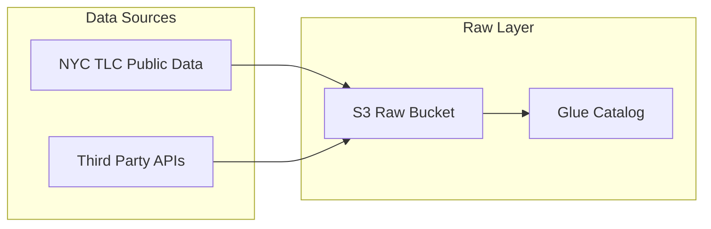
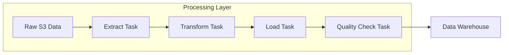
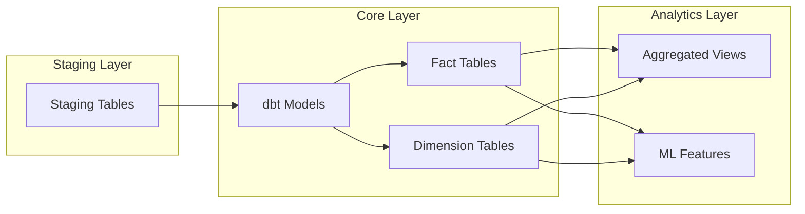
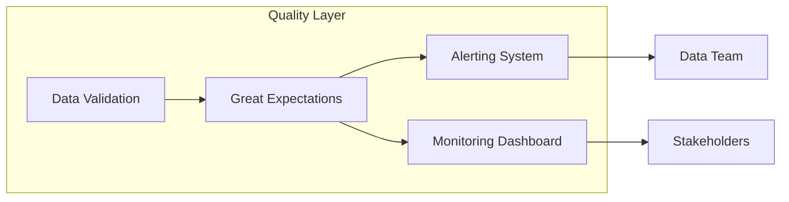
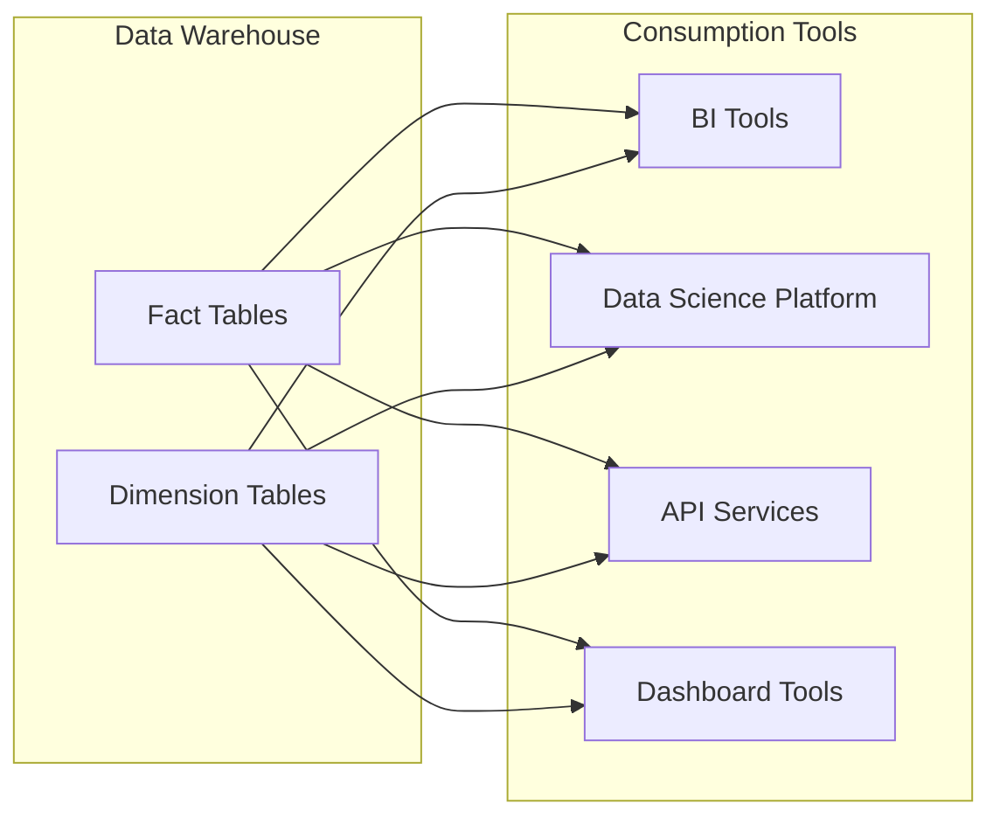

# Data Flow

This document describes the end-to-end data flow in the NYC TLC Data Platform, from raw data ingestion to final consumption.

## Ingestion Flow

### Raw Data Ingestion
Raw taxi data is ingested from multiple sources:
- Yellow taxi trip records
- Green taxi trip records
- FHV (For-Hire Vehicle) data
- Taxi zone lookup data

The data is stored in Parquet format in S3 for efficient processing.

## Processing Flow

### ETL Process
The ETL process includes several steps:

1. **Extract**: Read data from S3 raw bucket
2. **Transform**: Clean, validate, and enrich the data
3. **Load**: Insert processed data into PostgreSQL
4. **Validate**: Run quality checks using Great Expectations

## Transformation Flow

### dbt Transformations
dbt models transform the staging data into dimensional models:
- Fact tables containing business events
- Dimension tables containing reference data
- Aggregated views for common analytics queries

## Quality Assurance Flow

### Quality Checks
Data quality is enforced through:
- Schema validation
- Range checks for numeric fields
- Completeness checks for required fields
- Cross-reference validations
- Business rule validations

## Consumption Flow

### End User Access
Data is consumed through multiple channels:
- Business Intelligence tools (Tableau, Power BI)
- Data science platforms (Jupyter, RStudio)
- REST APIs for application integration
- Self-service dashboards