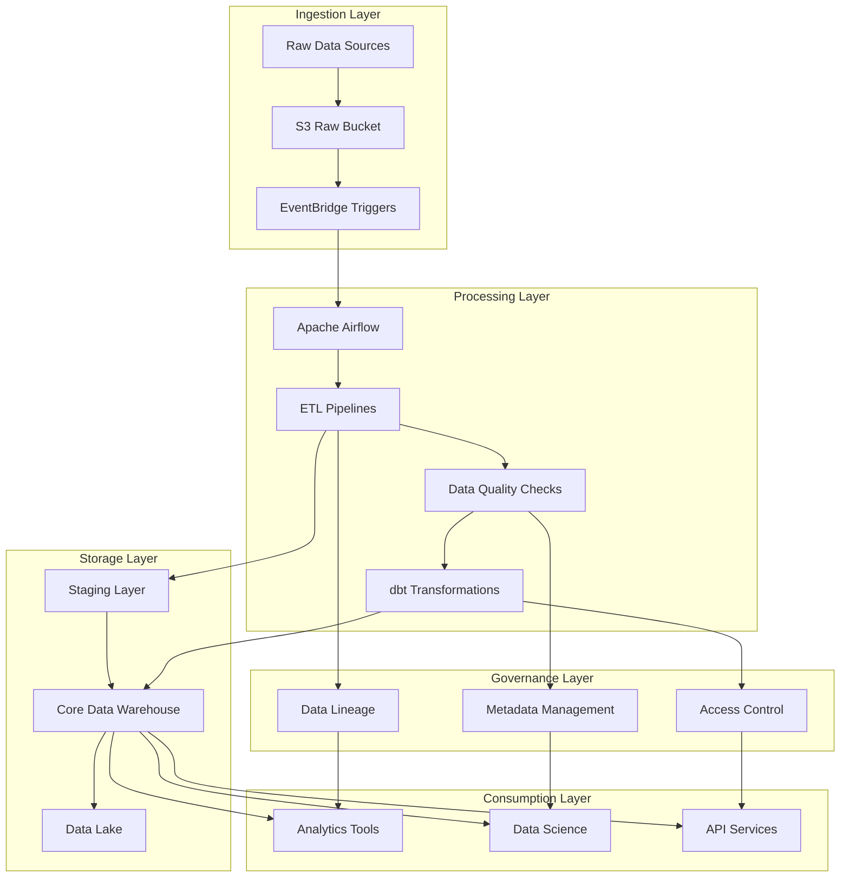

# Architecture Overview

The NYC TLC Data Platform follows a modern data architecture pattern that includes ingestion, processing, storage, and consumption layers. This document provides an overview of the system architecture and its components.

## Architecture Diagram

## Data Flow

The data flows through the platform in the following stages:

1. **Ingestion**: Raw data from NYC TLC is stored in S3
2. **Processing**: Airflow orchestrates ETL pipelines that clean and validate data
3. **Storage**: Processed data is stored in PostgreSQL data warehouse
4. **Transformation**: dbt models create dimensional models
5. **Consumption**: End users access data through various tools

## Components

### Ingestion Layer
- **S3 Raw Bucket**: Stores raw taxi data in Parquet format
- **AWS Glue**: Catalogs data and creates table definitions
- **EventBridge**: Triggers processing workflows

### Processing Layer
- **Apache Airflow**: Orchestrates ETL pipelines
- **Great Expectations**: Validates data quality
- **Custom Python Scripts**: Performs data transformations

### Storage Layer
- **PostgreSQL**: Core data warehouse with dimensional model
- **S3 Data Lake**: Stores processed data in Parquet format

### Governance Layer
- **Data Lineage**: Tracks data transformations and dependencies
- **Metadata Management**: Maintains data dictionaries and schemas
- **Access Control**: Manages user permissions and roles

## Technologies Used

- **Cloud**: AWS (S3, RDS, Glue, EventBridge)
- **Orchestration**: Apache Airflow
- **Data Quality**: Great Expectations
- **Transformation**: dbt (data build tool)
- **Database**: PostgreSQL
- **Documentation**: MkDocs with Material theme
- **Visualization**: Mermaid for diagrams