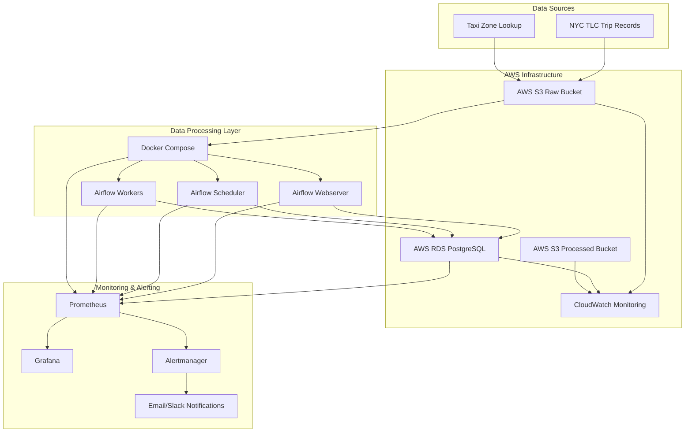
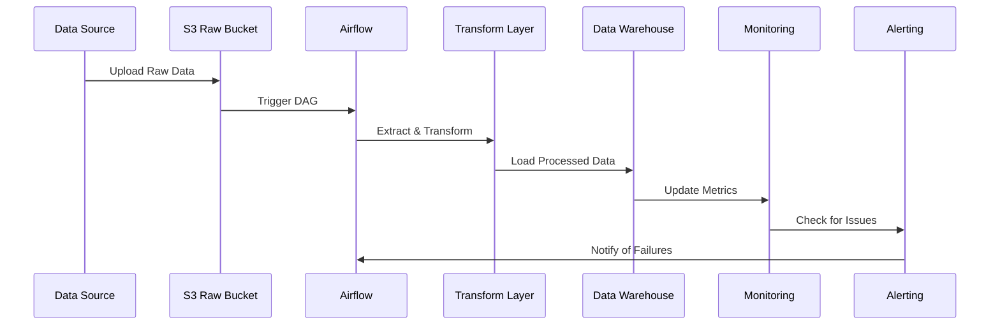

# NYC TLC Data Platform - Comprehensive Documentation

## Architecture Overview

### High-Level Architecture


### Data Flow Architecture


## System Components

### 1. Data Ingestion Layer
- **S3 Buckets**: Raw and processed data storage
- **Data Downloader**: Scripts to fetch data from NYC TLC
- **File Format Support**: Parquet, CSV

### 2. Orchestration Layer
- **Apache Airflow**: Workflow management
- **DAGs**: Yellow taxi, Green taxi, Quality monitoring
- **Scheduling**: Daily execution with error handling

### 3. Data Processing Layer
- **ETL Pipelines**: Extract, Transform, Load operations
- **Data Quality Checks**: Validation and monitoring
- **Error Handling**: Retry mechanisms and logging

### 4. Data Storage Layer
- **PostgreSQL**: Data warehouse with optimized schema
- **Indexes**: Performance optimization
- **Partitioning**: Time-based data organization

### 5. Monitoring & Alerting Layer
- **Prometheus**: Metrics collection
- **Grafana**: Dashboard visualization
- **CloudWatch**: AWS resource monitoring
- **Alertmanager**: Notification routing

## Deployment Instructions

### Local Development Setup

1. **Clone the repository**
```bash
git clone <repository-url>
cd nyc-tlc-data-platform
```

2. **Set up environment variables**
```bash
cp .env.example .env
# Edit .env with your configuration
```

3. **Build and start services**
```bash
docker-compose up -d --build
```

4. **Initialize Airflow database**
```bash
docker-compose exec webserver airflow db init
```

5. **Create an Airflow user**
```bash
docker-compose exec webserver airflow users create \
    --username admin \
    --firstname Admin \
    --lastname User \
    --role Admin \
    --email admin@example.com
```

### AWS Deployment Considerations

1. **S3 Setup**
   - Create raw and processed buckets
   - Configure lifecycle policies
   - Set up cross-region replication if needed

2. **RDS Configuration**
   - Choose appropriate instance size
   - Configure backup and maintenance windows
   - Set up read replicas for high availability

3. **Security**
   - Use IAM roles and policies
   - Enable encryption at rest and in transit
   - Configure VPC and security groups

## How to Generate Screenshots

### 1. Airflow UI Screenshots
1. Access Airflow UI at `http://localhost:8080`
2. Log in with your credentials
3. Navigate to:
   - **DAGs List**: Shows all available DAGs
   - **Individual DAG View**: Shows the specific DAG's tasks and execution history
   - **Graph View**: Shows the DAG's task dependencies
   - **Tree View**: Shows historical runs
   - **Gantt Chart**: Shows task execution timelines

### 2. Grafana Dashboard Screenshots
1. Access Grafana at `http://localhost:3000`
2. Log in with default credentials (admin/admin)
3. Navigate to dashboards:
   - **NYC TLC Overview Dashboard**: Shows system health metrics
   - **Airflow Monitoring Dashboard**: Shows Airflow-specific metrics
   - **Custom Dashboards**: Create additional dashboards as needed

### 3. Database Schema Screenshots
1. Connect to PostgreSQL using a database client
2. Take screenshots of:
   - **Schema Browser**: Shows table structures
   - **Query Results**: Shows sample data
   - **Performance Metrics**: Shows query execution plans

### 4. Monitoring System Screenshots
1. Access Prometheus at `http://localhost:9090`
2. Take screenshots of:
   - **Expression Browser**: Shows metric queries
   - **Status Page**: Shows configuration and targets
   - **Alerts Page**: Shows active alerts

## Monitoring and Alerting Setup

### Prometheus Configuration
The platform includes a comprehensive Prometheus configuration that monitors:
- **System Metrics**: CPU, memory, disk usage
- **Container Metrics**: Docker container performance
- **Application Metrics**: Airflow-specific metrics
- **Database Metrics**: PostgreSQL performance metrics

### Alerting Rules
The system includes alerting rules for:
- **Pipeline Failures**: DAGs that fail or take too long
- **Data Quality Issues**: Invalid or missing data
- **Resource Constraints**: High CPU, memory, or disk usage
- **Data Freshness**: Data that hasn't been updated recently

### Dashboard Descriptions

#### NYC TLC Overview Dashboard
- **System Resources**: CPU, memory, and disk usage across all services
- **Data Processing Volume**: Number of records processed over time
- **Data Quality Metrics**: Quality metrics like null values, invalid ranges
- **Pipeline Status**: Success/failure rates of data pipelines
- **PostgreSQL Metrics**: Database connections, query performance

#### Airflow Monitoring Dashboard
- **DAG Run Status**: Success, failure, and running counts
- **Task Instance Status**: Task-level success/failure rates
- **Worker Status**: Number of active workers
- **Scheduler Health**: Scheduler heartbeat and performance
- **DAG Processing Stats**: Statistics on DAG processing

## Production Considerations

### Performance Optimization
- **Indexing**: Proper indexes on frequently queried columns
- **Partitioning**: Time-based partitioning for large tables
- **Connection Pooling**: Use connection pooling for database connections
- **Parallel Processing**: Configure appropriate number of Airflow workers

### Security Best Practices
- **Network Security**: Use VPCs and security groups
- **Encryption**: Enable encryption for data at rest and in transit
- **Access Control**: Implement proper IAM roles and policies
- **Monitoring**: Set up comprehensive logging and monitoring

### Backup and Recovery
- **Database Backups**: Regular automated backups
- **Pipeline Recovery**: Mechanisms to reprocess failed data
- **Disaster Recovery**: Plan for system-wide failures
- **Data Validation**: Verify data integrity after recovery

## Troubleshooting Guide

### Common Issues and Solutions

1. **Airflow DAGs Not Running**
   - Check scheduler logs: `docker-compose logs scheduler`
   - Verify database connectivity
   - Check for resource constraints

2. **Data Quality Alerts**
   - Review data validation rules
   - Check source data for anomalies
   - Update transformation logic if needed

3. **Performance Issues**
   - Monitor resource usage
   - Optimize queries and transformations
   - Scale infrastructure as needed

4. **Monitoring Gaps**
   - Verify Prometheus targets are healthy
   - Check Grafana data sources
   - Review alerting rules

### Recovery Procedures

1. **Pipeline Failure Recovery**
   - Identify the failed task
   - Check logs for error details
   - Fix the underlying issue
   - Clear and re-run the task

2. **Data Corruption Recovery**
   - Identify affected data range
   - Remove corrupted data
   - Re-run the relevant pipeline
   - Verify data integrity

## Testing and Validation

### Unit Tests
- Individual function tests for data processing
- Database operation tests
- S3 interaction tests

### Integration Tests
- End-to-end pipeline tests
- Data quality validation tests
- Alerting system tests

### Performance Tests
- Load testing for data processing
- Stress testing for infrastructure
- SLA compliance verification

## Maintenance Procedures

### Regular Maintenance
- Database maintenance and optimization
- Log rotation and cleanup
- Security patching
- Dependency updates

### Monitoring Maintenance
- Review and update alerting rules
- Optimize dashboard queries
- Update monitoring configurations
- Verify backup systems

## Conclusion

The NYC TLC Data Platform provides a comprehensive, production-ready solution for processing NYC taxi trip data. The platform includes robust ETL pipelines, comprehensive monitoring, and alerting systems to ensure reliable data processing at scale.

Key features include:
- Scalable architecture using Docker and Airflow
- Comprehensive monitoring with Prometheus and Grafana
- Automated alerting with email and Slack notifications
- Data quality validation and monitoring
- Production-ready troubleshooting and recovery procedures

The platform is designed to handle billions of trip records with 99% uptime SLA and provides the foundation for advanced analytics and reporting.