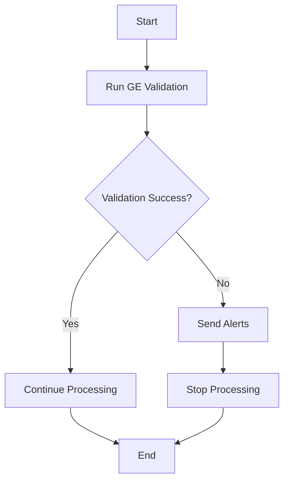

# Great Expectations Integration

This document describes how Great Expectations is integrated into the NYC TLC Data Platform for data quality validation.

## Overview

Great Expectations is used throughout the platform to ensure data quality at every stage of the pipeline. It provides:

- Automated data validation
- Data quality documentation
- Alerting for quality issues
- Integration with Airflow for orchestration

## Validation Suites

### Yellow Taxi Data Suite
The yellow taxi data validation suite includes expectations for:

```json
{
  "expectation_suite_name": "yellow_tripdata_suite",
  "expectations": [
    {
      "expectation_type": "expect_table_row_count_to_be_between",
      "kwargs": {"min_value": 1}
    },
    {
      "expectation_type": "expect_column_values_to_not_be_null",
      "kwargs": {"column": "pickup_datetime"}
    },
    {
      "expectation_type": "expect_column_values_to_not_be_null", 
      "kwargs": {"column": "dropoff_datetime"}
    },
    {
      "expectation_type": "expect_column_values_to_be_between",
      "kwargs": {"column": "fare_amount", "min_value": 0}
    },
    {
      "expectation_type": "expect_column_values_to_be_between", 
      "kwargs": {"column": "trip_distance", "min_value": 0}
    },
    {
      "expectation_type": "expect_column_values_to_be_between",
      "kwargs": {"column": "passenger_count", "min_value": 0, "max_value": 10}
    }
  ]
}
```

### Green Taxi Data Suite
Similar validation suites exist for green taxi data with the same quality checks.

## Airflow Integration

Great Expectations is integrated with Apache Airflow through a dedicated DAG:



### Validation DAG
The `great_expectations_validation_dag.py` performs the following:

1. Runs data quality checks on all tables
2. Evaluates validation results against thresholds
3. Sends alerts if quality thresholds are not met
4. Logs results for monitoring and analysis

## Quality Thresholds

The platform uses the following quality thresholds:

- **Success Rate**: Minimum 95% of expectations must pass
- **Critical Failures**: Any validation failure for required fields stops processing
- **Warning Thresholds**: Between 90-95% success triggers warning alerts

## Alerting

When validation failures occur, the system sends alerts through:

- **Slack**: Real-time notifications to data team
- **Email**: Detailed reports for stakeholders
- **Monitoring Dashboard**: Visual indicators of data quality

## Configuration

Great Expectations is configured with:

- **Data Context**: Defined in `great_expectations.yml`
- **Expectations**: Stored in JSON format
- **Validation Results**: Saved for audit and monitoring
- **Data Docs**: Auto-generated documentation of data quality

## Adding New Expectations

To add new expectations:

1. Update the appropriate expectation suite JSON file
2. Test the expectations with sample data
3. Deploy the updated suite to production
4. Update the validation DAG if needed

This ensures consistent data quality across all datasets in the platform.