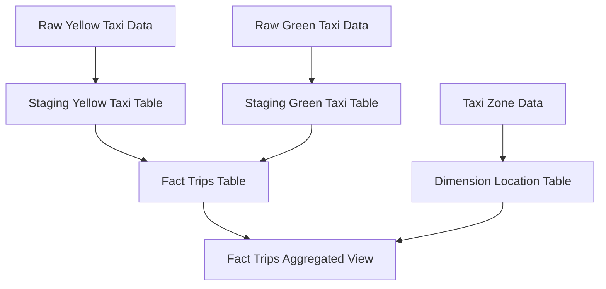
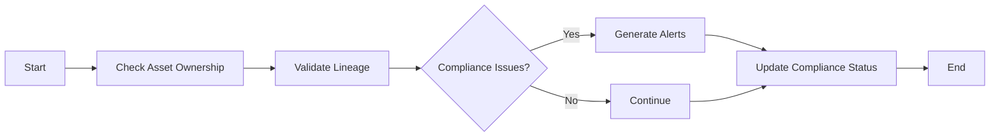
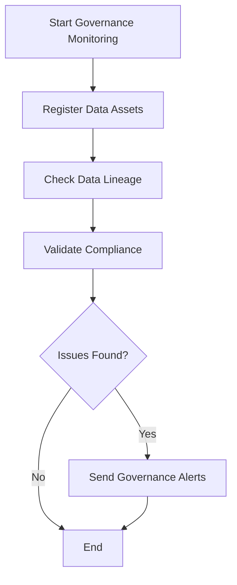

# Data Governance

This document outlines the data governance policies and practices implemented in the NYC TLC Data Platform.

## Overview

Data governance ensures that data assets are managed according to established policies, standards, and procedures. The platform implements governance through:

- Data lineage tracking
- Metadata management
- Access control
- Compliance monitoring

## Data Lineage

### Lineage Tracking

Data lineage is tracked automatically using the DataGovernanceManager:



### Lineage Metadata

Each data asset stores lineage information including:
- Source assets (upstream dependencies)
- Target assets (downstream consumers)
- Transformation logic
- Creation and modification timestamps

## Metadata Management

### Asset Registration

All data assets are registered in the governance system:

```python
from scripts.data_governance import DataAsset, DataGovernanceManager
from datetime import datetime

# Register a new data asset
asset = DataAsset(
    name="fact_trips",
    type="table",
    location="postgres://warehouse/core/fact_trips",
    owner="data-engineering-team",
    created_at=datetime.now(),
    updated_at=datetime.now(),
    description="Core fact table for taxi trips",
    tags=["core", "fact", "taxi", "nyc-tlc"],
    lineage=["staging_yellow_tripdata", "staging_green_tripdata"]
)

governance_manager = DataGovernanceManager()
governance_manager.register_data_asset(asset)
```

### Metadata Schema

Each asset includes the following metadata:
- **Name**: Unique identifier for the asset
- **Type**: Table, view, file, API, etc.
- **Location**: Physical location of the asset
- **Owner**: Team or individual responsible
- **Description**: Human-readable description
- **Tags**: Classification labels
- **Lineage**: Upstream and downstream dependencies

## Access Control

### IAM Roles

The platform implements role-based access control with the following roles:

```json
{
  "data_engineer": {
    "description": "Full access to data processing and transformation",
    "permissions": [
      "s3:GetObject",
      "s3:PutObject", 
      "glue:GetTable",
      "redshift:Select*",
      "airflow:Get*"
    ]
  },
  "data_analyst": {
    "description": "Read-only access to processed data",
    "permissions": [
      "s3:GetObject",
      "glue:GetTable",
      "redshift:Select*"
    ]
  },
  "data_scientist": {
    "description": "Read access with ability to run transformations",
    "permissions": [
      "s3:GetObject",
      "s3:PutObject",
      "glue:GetTable",
      "redshift:Select*",
      "redshift:Create*"
    ]
  }
}
```

### Access Policies

Access is controlled through:
- **Role-based permissions**: Users assigned to appropriate roles
- **Resource-level security**: Fine-grained access to specific assets
- **Audit logging**: All access attempts are logged for compliance

## Compliance Monitoring

### Compliance Checks

The governance system performs regular compliance checks:



### Monitoring Areas

Compliance monitoring covers:
- **Asset ownership**: All assets must have assigned owners
- **Documentation**: Assets must have descriptions
- **Lineage completeness**: All dependencies must be tracked
- **Access compliance**: Permissions must follow least-privilege principle

## Data Quality Governance

### Quality Standards

Governance includes quality standards:
- **Completeness**: Required fields must not be null
- **Accuracy**: Values must be within expected ranges
- **Consistency**: Cross-reference values must match
- **Timeliness**: Data must be updated within SLA timeframes

### Quality Monitoring

Quality is monitored through:
- **Automated validation**: Great Expectations checks
- **Threshold alerts**: Notifications when quality drops
- **Trend analysis**: Tracking quality over time
- **Root cause analysis**: Investigation of quality issues

## Implementation

### Database Tables

Governance metadata is stored in PostgreSQL:

```sql
CREATE SCHEMA IF NOT EXISTS data_governance;

-- Track data assets
CREATE TABLE data_governance.data_assets (
    id SERIAL PRIMARY KEY,
    name VARCHAR(255) NOT NULL UNIQUE,
    type VARCHAR(100) NOT NULL,
    location VARCHAR(500),
    owner VARCHAR(255),
    description TEXT,
    tags JSONB,
    created_at TIMESTAMP DEFAULT CURRENT_TIMESTAMP
);

-- Track data lineage
CREATE TABLE data_governance.data_lineage (
    id SERIAL PRIMARY KEY,
    source_asset VARCHAR(255) REFERENCES data_governance.data_assets(name),
    target_asset VARCHAR(255) REFERENCES data_governance.data_assets(name),
    transformation TEXT,
    created_at TIMESTAMP DEFAULT CURRENT_TIMESTAMP
);
```

### Airflow Integration

Governance monitoring is integrated with Airflow:



The `data_governance_monitoring_dag.py` runs daily governance checks and alerts teams to any compliance issues.