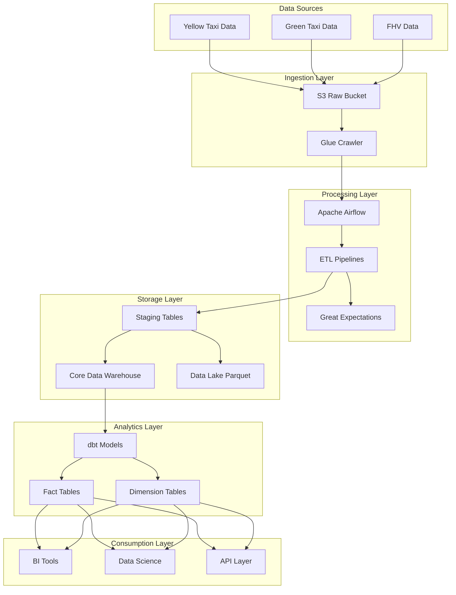

# NYC TLC Data Platform

Welcome to the NYC Taxi and Limousine Commission (TLC) Data Platform documentation. This platform processes and analyzes taxi trip data from NYC, providing valuable insights for city planning, transportation analysis, and research.

## Overview

The NYC TLC Data Platform is a comprehensive data engineering solution that:

- Ingests raw taxi trip data from multiple sources
- Applies data quality checks and transformations
- Implements robust data governance and lineage tracking
- Provides analytical capabilities through dimensional modeling
- Ensures compliance with data governance policies

## Architecture

## Key Features

- **Data Quality**: Automated validation using Great Expectations
- **Governance**: Comprehensive lineage tracking and metadata management
- **Scalability**: Cloud-native architecture using AWS services
- **Monitoring**: Real-time alerting and monitoring capabilities
- **Compliance**: Adherence to data governance policies

## Getting Started

Check out our [Development Setup](development/setup.md) guide to get started with the platform.